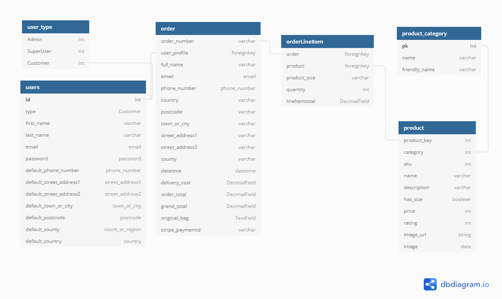

# Photography Philosophy deployed via Heroku at <a href="https://photography-philosophy.herokuapp.com/">LanthusClark.com</a>

* This project in its current state is purely for educational purposes. 

# CONTENTS

* UX
  * <a href="#Owner-Goals">Owner Goals</a>
  * <a href="#User-Goals">User Goals</a>
  * <a href="#User-Stories">User Stories</a>
  * <a href="#My-Strategy">Strategy</a>
* <a href="#User-Interface">UI</a>
* <a href="#Features">Features</a>
* <a href="#Scope">Scope</a>
* <a href="#Information-Architecture">Information Architecture</a>
* <a href="#Defensive-Design">Defensive Design</a>
* <a href="#Technologies">Technologies Used</a>
* <a href="#Sources">Sites Sourced from</a>
* <a href="#Testing">Testing</a>
* <a href="#Bugs">Bugs</a>
* <a href="#Deployment">Deployment</a>
* <a href="#Credits">Credits</a>

# **UX**

# Owner Goals

#### As the owner, my goals are:

* To showcase my photography skills and generate income

# User Goals

#### For the user the goals are:

* To be able to:

# User Stories

1. "As a **Photography enthusiast** I'm interested in browsing the photography sites and having the images presented in a clear way"
2. "As a **Random User** I want to understand as fast as possible what this site can offer me"
3. "As a **Fan of the Site Owner** I want to browse his collection of photos and possibly purchase a print or two"
4. "As a user I want to have:
..* Non-login checkout
..* To see my items in my basket
..* To be able to search the site
..* I want to have a smooth buying experience
..* I want to be notified about my actions while on the site
..* I want to clearly see how much I'm spending
..* I want to be informed of any possible shippping costs 
..* I would like to be able to register an account
..* I want to be able to save my shipping address for future use

# My Strategy

* For this project I focussed primarily on the backend. This involved a lot of learning as the project developed.
* I did some initial wireframes for the landing page and how I wanted to setup the products display.
* I planned on using a simple card scheme that I had seen used on other sites as well as the Boutique Ado project from Code Institute
* I relied heavily on the Boutique Ado project while developing this project. I found that many times the reason that my code wasn't working
* was due to a small typo, or forgetting to add a path to the urls.py etc. 

* While the backend was my priority I did not want to skimp on the front end either, though in the end perhaps the admin_hub didn't quite realise
* the full scope of what I had hoped to present with this project.

## Seperate Branches 

* Midway through the project I received feedback on my previous milestone with this excellent suggestion: "The next step of progress should be using separate branches for each feature implemented."
* I realised that I had already implemented quite a few features, but I began using seperate branches for each feature straight away.
* Using seperate branches saved me when about 70% through the project I was testing adding/deleting products in the Admin. I deleted one product and my database corrupted
* Some of the work I had done on the seperate branch was gone after this happened. 
* I was able to recover the project because I was working on a seperate branch and while unfortunately I had to delete the database and re-add all the products
* Most of the project was still there and safe in the Master branch.

# User Interface

* Initial concept

* I didn't want to go full greyscale, but I also wanted to use lighter/calmer colors to allow the images that I would be using for the project to really pop against the background.
* I went with a light blue/green background
* For badges and the navigation area I went with a semi-transparent background
* I didn't want a thick border, and 1 px was too thick for what I wanted so I wrapped most of the elements with a very thin box-shadow to give the appearance of a thin border.

* Fonts

  * I used Lato for the site font

# Features
## And who can use them

Admin/Superuser

- [x] Everything regular users can do plus:
- [x] Access Admin Hub
- [x] View at a glance how many Categories and Products there are Site Wide
- [x] See how many Products in each Category
- [x] Add a Category (Can only be done via the Backend /Admin)

- (Accessible via Products and Product Details and Admin_Hub, but action can only be done via the Admin_Hub)

- [x] Add a Product
- [x] Edit a Product
- [x] Delete a Product (Can be done via any of Products/Product_Details/Admin_Hub after confirmation click 'Yes' on delete confirmation modal)

Regular User

- [x] Shop and make a purchase without having to register an account
- [x] Register an account
- [x] Login
- [x] View Order History
- [x] View Details of each order
- [x] View Full Summary of each order including date/time order was placed
- [x] Add/Update their default shipping address
- [x] Send an email to the store owner
- [x] Browse Items
- [x] Search for Items
- [x] Search by Price/Rating
- [x] Sort Items by Name/A-Z/Z-A
- [x] Sort By Price Low to High
- [x] Sort By Price High to Low
- [x] Sort By Category A-Z 
- [x] Sort By Category Z-A
- [x] Navigate directly to specific Category (Through the Shop link in Navbar)
- [x] Add Items to cart 
- [x] Add multiples of one Item if they want
- [x] Select sizes on Items that have sizes
- [x] See the cart total cost of all their selected Items at any time
- [x] Adjust how many Items are in their cart
- [x] Adjust how many of each Item is in their cart
- [x] Remove Items from their cart
- [x] See a summary of their order before completing the order
- [x] See a grand total for their including shipping costs (if any)
- [x] See how much more they would have to spend to get free shipping (if the order total is below the threshold to trigger free shipping)
- [x] See a final warning regarding how much money will be charged to their card before confirming and completing the order
- [x] Get a notification when a successful order has gone through
- [x] Get an email with an order summary sent to them on completion of a successful order
- [x] Get notification when something goes working
- [x] 

# Features still to implement

- [ ] Show notification to user on successful email sent to owner
- [ ] Wire up the email app to get the UserProfile email address and populate the form with the email automatically
- [ ] Be able to rate items
- [ ] Be able to leave reviews on items purchased

# Scope

* This is a fully functional web store with Stripe in Test Mode
* No purchases from this version will be either charged or redeemed

# Information Architecture

* 

# Defensive Design

* Defensive Design was implemented using Webhooks and Python Decorators from Django

## Checkout
* Webhook handlers were setup to handle generic events, send confirmation emails on payment intent succeeding with stripe, failures and possible user errors.

On an order, the handler will first clean any data in shipping_details. This is to ensure that if the user has updated their shipping details in the form, the app will correctly populate the shipping_details.
If the user has selected 'save info' the webhandler will check if it is an anonymous user,
If the user has an account and is not 'anonymous' the information in the form will be saved to that users account.

The handler will then set order exists to false and try to get the order details:
* shipping details from the form
* item details from the bag/cart
* payment intent from stripe input

It will try 5 times to do this with a 1 second delay between tries.
If the order exists it will trigger the confirmation email, send a HTTP response of 200

If this does not succeed then it will set order to none and attempt to pull the order from the cache
If this fails it will cancel the payment intent and send a HTTP response of 500 to stripe

If however it is successful in populating the order from the cache it will trigger the confirmation email and send a HTTP response of 200 to Stripe

## Add/Edit/Delete

Using Python decorator of @require_login
Also the Add/Edit/Delete functions are only available to SuperUsers. A SuperUser can only be created by Admin or another SuperUser

# Technologies

* <a href="https://html.com/" target="_blank">HTML</a> - for overall UI structure
* <a href="https://css-tricks.com/" target="_blank">Css</a> - to style the site
* <a href="https://www.getbootstrap.com" target="_blank">Bootstrap 4.5.0</a> - for grid structure and responsive design
* <a href="https://www.fontawesome.com" target="_blank">Font Awesome</a> - for icons
* <a href="https://www.djangoproject.com/" target="_blank">Django</a> - as my framework
* <a href="https://www.python.com" target="_blank">Python</a> - for app routes and CRUD functionality
* <a href="https://jinja.palletsprojects.com/en/2.11.x" target="_blank">Jinja</a> - for templating, data routing and page information populating
* <a href="https://heroku.com" target="_blank">PostgreSQL from Heroku</a> - for the deployment Database and sqlite3 from Django for development
* <a href="https://www.jquery.com/" target="_blank">jQuery</a> - used by Bootstrap and for various site actions
* <a href="https://www.gitpod.io/" target="_blank">Gitpod</a> - as my development environment
* <a href="https://www.github.com/" target="_blank">GitHub</a> - for version control
* <a href="https://www.heroku.com" target="_blank">Heroku</a> - for deployment
* <a href="https://www.aws.com" target="_blank">AWS</a></a> - Amazon Web Services for hosting 'static' and 'media' files

## Technologies installed

asgiref==3.2.10
boto3==1.14.51
botocore==1.17.51
dj-database-url==0.5.0
Django==3.0.8
django-allauth==0.42.0  -> For User Authentication
django-countries==6.1.3  -> For Country Selector on Forms
django-crispy-forms==1.9.2  -> For Forms
django-storages==1.9.1  
docutils==0.15.2
gunicorn==20.0.4  -> To setup application for deployment to Heroku
jmespath==0.10.0
oauthlib==3.1.0
Pillow==7.2.0
psycopg2-binary==2.8.5
python3-openid==3.2.0
pytz==2020.1
requests-oauthlib==1.3.0
s3transfer==0.3.3
sqlparse==0.3.1   -> Parse/Format/Split sql statements
stripe==2.50.0  ->  Stripe Payments

# Sources

* <a href="https://www.w3schools.com">w3schools</a> - For general knowledge or whenever I was stuck on something simple
* Combed through the <a href="https://docs.djangoproject.com/en/3.1/">Django Docs</a> 99% of the time when stuck with the other 99% of the time referring back to Code Institue Boutique Ado project
* <a href="https://css-tricks.com/">Css Tricks</a> - to solve styling and element placement issues
* <a href="https://fonts.google.com/">Google Fonts</a> - for fonts
* <a href="https://fontawesome.com/">Font Awesome</a> - for Icons

# Testing

* Testing was done regularly throughout the entire process 
* Each function was tested and re-tested
* Defensive Design was tested by manually adding endpoints from areas where access should not be allowed
* Testing done on checkouts/logins/logouts/admin_hub/profile using back and forward buttons, manually adding endpoints and urls
* Site navigation and links tested thoroughly, navigation breaks also tested using the back and forward buttons

* I began writing tests for the project but due to unforseen circumstances I ran out of time and only have 2 views tests in the home app simply asserting that the views return the correct template
* And one forms test in the checkout app making sure the relevant fields are set to required

* All HTML validated with <a href="https://validator.w3.org/">w3 validator</a>
  * The HTML validator returned errors due to the jinja templating used to structure the site
* All CSS validated with <a href="https://jigsaw.w3.org/css-validator/">w3 css validator</a>

* I used various code and syntax checkers during the entire process and before project submission

**Checkers Used**
* <a href="https://extendsclass.com/python-tester.html">Python Syntax Checker</a>
* <a href="http://pep8online.com/">Python Checker</a>
* <a href="https://esprima.org/demo/validate.html">Esprima JavaScript Checker</a>
* <a href="https://jshint.com/">JsHint JavaScript Checker</a>

## This site has been tested manually by myself, friends, my mentor and fellow students at Code Institute

Browsers tested: 
* Chrome
* Microsoft Edge

Phones tested: 
* Huawei P20Lite
* iPhone 6
* Xaomi Mi 9

* Site also tested with Chrome's built in 'Inspect Element' preview panes simulating the iPad Pro, iPad, iPhone X, iPhone 6/7/8 plus, iPhone 6/7/8, iPhone 5 SE, Pixel 2 XL, Pixel 2 and Galaxy S5
* JS and jQuery code tested on <a href="https://www.repl.it" target="_blank">ReplIt</a>
* Entire site tested extensively with console log and print() - once functions/routes were found to be working as intended console.log and print() commands were removed
* All inter-site links tested on all pages across devices and found to be working
* All outward links directed at other sites tested and found to be working and opening in a new tab
* While watching the console log in real time, no major errors were found across the site

# Bugs

**Major Bugs**
* There was a major bug with the delete product function which caused all the products to be deleted instead of only one.
* This bug was caught during testing and has been removed/fixed.

No further bugs were detected during testing 

# Deployment

* This project and all project files are hosted on GitHub via my GitHub repository at 
* I coded the project using GitPod as my development environment. 
* This project is also hosted and deployed with Heroku

## To run this application in a cloud-based environment, you can deploy the code to Heroku. This section assumes you have succeeded at running the application in your local environment first, as described above.

* To deploy the project using Heroku
   1. Register an account at <a href="https://heroku.com" target="_blank">Heroku</a>
   2. Go to Heroku site, login and create a new app. Set a name for this app and select the closest region.
   3. In the Deploy tab of your App dashboard in Heroku, choose Deployment method. I chose Heroku Git, using Heroku CLI and logged in via the terminal using the command: heroku login
   4. In GitPod, create a requirements.txt file using the command pip3 freeze > requirements.txt in the terminal.
   5. Create a Procfile using the commant echo web: python app.py > Procfile in the terminal.

   Heroku deployment

On the Resources tab, in the Add-ons field type Heroku Postgres select the Hobby Dev then click the Provision button.

After setting the Postgress database in your Heroku Dashboard, go to the Settings of your app and then Reveal Config Vars and set the values as follows:

(Copy the values from your env.py file and paste them into Heroku) 

Key Value 

AWS_ACCESS_KEY_ID <-> <your_value>

AWS_SECRET_ACCESS_KEY <-> <your_value>

DATABASE_URL <-> <your_value>

EMAIL_HOST_PASS <-> <your_value>

EMAIL_HOST_USER <-> <your_value>

SECRET_KEY <-> <your_value>

STRIPE_PUBLIC_KEY <-> <your_value>

STRIPE_SECRET_KEY <-> <your_value>

STRIPE_WH_SECRET <-> <your_value>

DEVELOPMENT <-> False

PRODUCTION <-> True

USE_AWS <-> True

Grab the DATABASE_URL link from Heroku's Config Vars as we gonna need it to migrate to the Heroku Postgres database.

Back in your code editor terminal, go to settings.py in photography_philosophy and in the databases URL variable comment out the sqlite3 from django and paste in the url from Heroku
Do NOT commit or push to github or heroku at this point.

Now we're going to save the settings.py and in your terminal type

* python3 manage.py makemigrations --dry-run

check that all migrations show up properly then type:

* python3 manage.py makemigrations 

Now type into the terminal

* python3 manage.py migrate --plan 

Double check the migrations and then migrate

* python3 manage.py migrate

This should populate the heroku PostgreSQL database 

Create the superuser for the postgres database so you can have access to the django admin.

python manage.py createsuperuser
Now we need to add the required data into the database in the following order:

python manage.py loaddata categories
python manage.py loaddata products

Now go back to settings.py in photography_philosophy and for your database environment variables put this:

if 'DATABASE_URL' in os.environ:
    DATABASES = {
        'default': dj_database_url.parse(os.environ.get('DATABASE_URL'))
    }
else:
    DATABASES = {
        'default': {
            'ENGINE': 'django.db.backends.sqlite3',
            'NAME': os.path.join(BASE_DIR, 'db.sqlite3'),
        }
    }

Save settings.py

With everything set commit the changes, push to github and then:

* Login to Heroku via the terminal using command heroku login
* Push your changes using: git push heroku master

From the Heroku dashboard of your newly created application, click on the "Deploy" tab, then scroll down to the "Deployment method" section and select GitHub.

Use the GitHub link and type in the name of the repository and click the search button. Then connect the Heroku app to the desired GitHub repository.

On the Deployment Tab, scroll a bit further down to the "Manual Deploy" section, select the master branch then click "Deploy Branch".

Once your application is running, you may want to update the Deployment method from Manual to Automatic.

   
   9. From Heroku you can now click 'Open App'. If all steps were completed correctly the app should run successfully
   10. You can also access the app using this url type:  https://photography_philosophy.herokuapp.com/
   11. You can access the admin with your superuser credentials via https://photography_philosophy.herokuapp.com/admin

## There are no differences between the currently deployed site and the development version at this time.

## To run the project locally

To clone this project from GitHub:

* Under the repository name, click "Clone or download".
  1. In the Clone with HTTPs section, copy the clone URL for the repository ( For this repository: https://github.com/Jays-T/photography_philosophy_v1.git ).
  2. In your local IDE open Git Bash.
  3. Change the current working directory to the location where you want the cloned directory to be made.
  4. Type git clone, and then paste the URL you copied in Step 3.
  5. The command should look like this:  git clone https://github.com/Jays-T/photography_philosophy_v1.git
  6. Press enter and your local clone will be created and the response should be something like this:
> * $ git clone https://github.com/YOUR-USERNAME/YOUR-REPOSITORY
> * Cloning into `Spoon-Knife`...
> * remote: Counting objects: 10, done.
> * remote: Compressing objects: 100% (8/8), done.
> * remove: Total 10 (delta 1), reused 10 (delta 1)
> * Unpacking objects: 100% (10/10), done.
* For further reading and troubleshooting on cloning a repository from GitHub you can go <a href="https://help.github.com/en/github/creating-cloning-and-archiving-repositories/cloning-a-repository" target="_blank">here</a>.

  7. Technologies to install

- [x] asgiref==3.2.10
- [x] boto3==1.14.51
- [x] botocore==1.17.51
- [x] dj-database-url==0.5.0
- [x] Django==3.0.8
- [x] django-allauth==0.42.0
- [x] django-countries==6.1.3
- [x] django-crispy-forms==1.9.2
- [x] django-storages==1.9.1
- [x] docutils==0.15.2
- [x] gunicorn==20.0.4
- [x] jmespath==0.10.0
- [x] oauthlib==3.1.0
- [x] Pillow==7.2.0
- [x] psycopg2-binary==2.8.5
- [x] python3-openid==3.2.0
- [x] pytz==2020.1
- [x] requests-oauthlib==1.3.0
- [x] s3transfer==0.3.3
- [x] sqlparse==0.3.1
- [x] stripe==2.50.0

# To preview in your browser

If you are using gitpod as your IDE:
The project runs only from the Master branch the main directory of which is:  /workspace/photography_philosophy_v1
When in the main directory enter the following into the terminal command prompt
1. python3 manage.py runserver
2. This will run the contents of the directory on a local web server, on port 8080.
3. If you are working in Gitpod this will give you an option to 'open browser' which will open the default route '/' and load the landing page
4. If you want to stop the local server from running, in the command prompt simply press crtl + C

# Credits

**Code**

* Major credits go to <a href="https://github.com/ckz8780" target="_blank">Chris Zielinski</a> and the <a href="https://github.com/ckz8780/boutique_ado_v1" target="_blank">Boutique Ado Project</a>
* I referred to the above project many times during this process and a large part of the coding logic was adapted from this project

## Content

* Text on the site was written by myself

## Media

* All images on the site taken by and are property of Lanthus Clark and his person. 
* The <a href="https://realfavicongenerator.net/favicon" target="_blank">favicon generator</a> used for favicon

## Acknowledgements

## Thank you to my mentor **@rheyannmagcalas_mentor** for your advice given througout my journey with Code Institute
## Thank you to h4xnoodle for your advice and consistently reminding me not to overcomplicate things.
## Thank you to Charlie and JimLynx for your advice and moral support
## Thank you to O-Bim-Wan-Kenobi - the Mr Bim for his sage advice on development practice, UI and UX design and logic and for your encouragement and willingness to spend your time listening and helping

## Thank you to all the staff at Code Institute - From the instructors to the mentors, the people in slack who give of their time each day to help and advise us who are learning,
## to those creating the course material to those crafting the UX to those constructing and developing the backend. Thank you so much!

# FAIR-USE COPYRIGHT DISCLAIMER

* This version is for educational use.